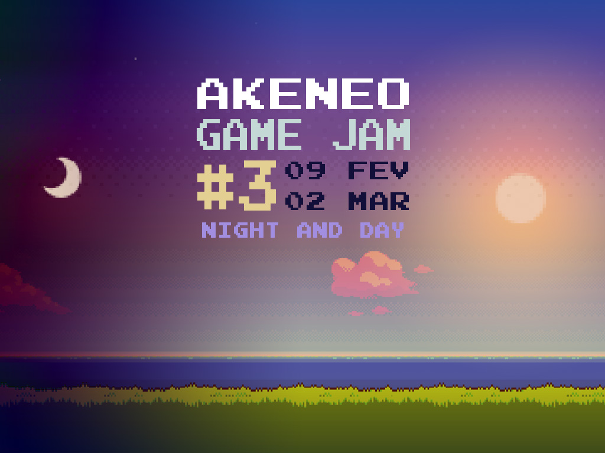
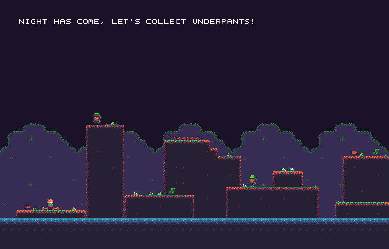
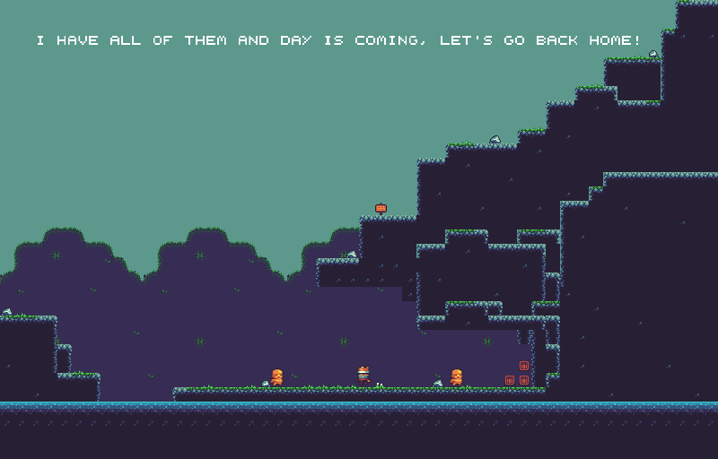

# Underpants Gnomes

Small platformer game rushly developed #uglyCodeAndBugsInside with Typescript + Phaser JS for the Akeneo Game Jam #3.



# Demo

You can access to the demo here https://nidup.github.io/underpants-gnomes/

The demo is deployed on the `gh-pages` branch versionning the `build/bundles.js` file (npm run build to update).

# Screenshots





# Getting Started

### Pre-requisites

You need to have `node` and `npm` installed

### Dependencies

To install dependencies, run:
```
npm install
```

This will install all required local dependencies

### Building the project

To build project you can use:

```
npm run build
```

### Running in dev mode:

```
npm run dev
```

# Artwork and special thanks

Thx @grena for the Game Jam org!

Thx @wlk for the following boilerplate https://github.com/wlk/phaser-typescript-boilerplate

Thx Buch for the Art Work http://opengameart.org/content/a-platformer-in-the-forest

Thx Puddin for the Art Work http://opengameart.org/content/rotating-coin

Thx Trey Parker & Matt Stone for the original Underpants Gnome idea https://en.wikipedia.org/wiki/Gnomes_(South_Park)
