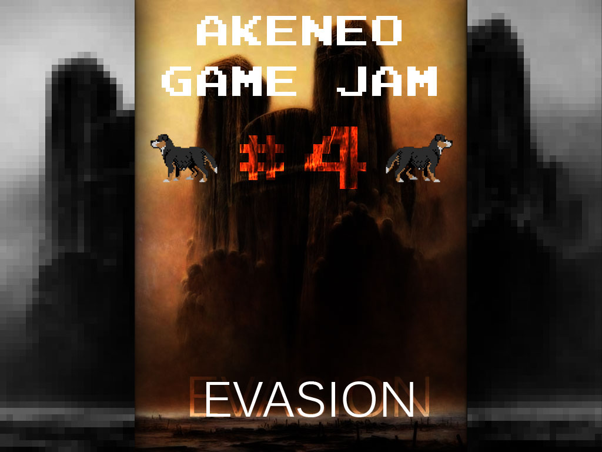
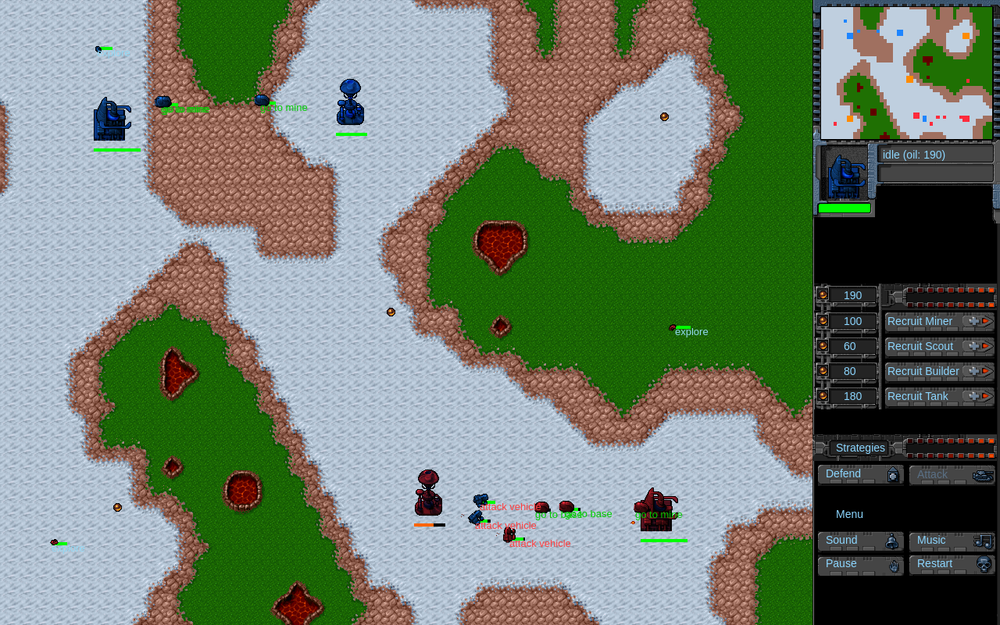

# Collect & Conquer: Blue Alert

Mini RTS game developed for the Akeneo Game Jam #4.

Playing with steering behaviors, stacked FSM, A* path finding and procedural map generation.



# Demo

You can access to the demo [here](https://nidup.github.io/collect-and-conquer/)

# Screenshots



# Getting Started to Dev

## Pre-requisites

You need to have `docker` installed

## Build the dev image

```
docker build -t nidup/phaserjs .
```

Your image should appears in the list when typing,
```
docker images
```

## Run the dev image

Run to mount local project code inside the container and bind ports
```
docker run --name phaserjs-ai-sandbox -v "$PWD":/usr/src/app -p 8080:8080 -d nidup/phaserjs
```

Your container should appears in the list when typing,
```
docker ps
```

## Install / update project dependencies

```
docker exec -it phaserjs-ai-sandbox npm install
```

## Running the project in dev mode:

Launch webpack server in watch mode,
```
docker exec -it phaserjs-ai-sandbox npm run dev
```

You can access your project in your browser,
```
http://localhost:8080/
```

# Deploy in production

We deploy online version directly from our Github repository with https://pages.github.com/

## Checkout the gh-page and rebase master on

```
git checkout gh-pages
git rebase master -i
```

## Build the bundle.js

```
docker exec -it phaserjs-ai-sandbox npm run build
```

## Commit then push the bundle.js

```
git add build/bundle.js
git commit
git push
```

## Check the deployment

The game is available on the following website,
```
https://nidup.github.io/phaserjs-ai-sandbox/
```

# Troubleshooting

## Conflict. The container name "/phaserjs-ai-sandbox" is already in use by container

```
docker rm phaserjs-ai-sandbox
```

# Utils

## Connect in bash to the dev image

Run,
```
docker exec -it phaserjs-ai-sandbox bash
```

Your local files should be mounted in the container,
```
ls
Dockerfile  LICENSE  README.md	assets	bin  doc  index.html  lib  package.json  src  tsconfig.json  webpack.config.js
```

# Resources

## Steering Behavior

 - http://www.red3d.com/cwr/steer/
 - https://gamedevelopment.tutsplus.com/series/understanding-steering-behaviors--gamedev-12732

## Finite State Machine

 - https://gamedevelopment.tutsplus.com/tutorials/finite-state-machines-theory-and-implementation--gamedev-11867

## Assets

 - http://lunar.lostgarden.com/game_HardVacuum.htm

## Sounds

 - https://phaser.io/examples/v2/audio/pause-and-resume
 - https://phaser.io/examples/v2/audio/sound-complete

# Thanks

 - @grena for dat game jam org! :tada:
 - @pierallard for procedural map generation! :tada:
